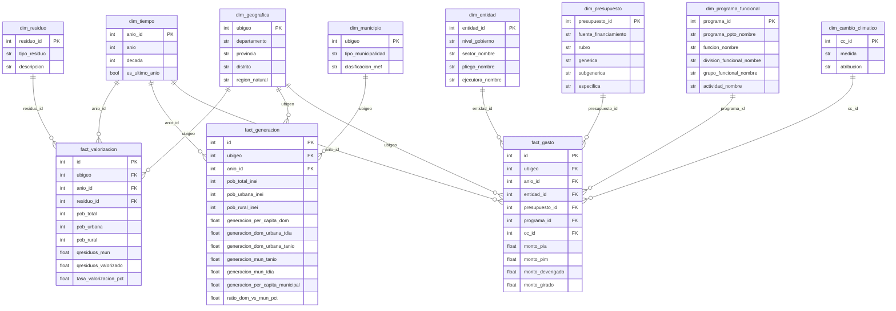

# Anális de Residuos Sólidos Perú 2019–2024 mediante técnicas de BI

**Integrantes:**
- Marx Rojas Rojas
- Joyssie Rivas Ríos

**Curso:** Business Intelligence
**Universidad:** Universidad del Pacífico
**Ciclo:** 2026-I

---

## 1. Marco Teórico

### 1.1 Business Intelligence
El Business Intelligence (BI) comprende las metodologías y tecnologías que permiten transformar datos en bruto en información significativa para la toma de decisiones estratégicas (Negash, 2004). En el presente trabajo, el BI se aplica sobre los datos de SIGERSOL para dotar al MINAM de una herramienta analítica que facilite el monitoreo de la gestión de residuos sólidos a nivel nacional.

### 1.2 OLAP y Modelo Dimensional
OLAP (On-Line Analytical Processing) agiliza la consulta de grandes volúmenes de datos mediante estructuras multidimensionales, permitiendo analizar causas, encontrar patrones y obtener respuestas rápidas a preguntas complejas (Codd et al., 1993).

El modelo dimensional, propuesto por Ralph Kimball, organiza los datos en **tablas de hechos** — métricas cuantitativas — y **tablas de dimensiones** — contexto de análisis. La estructura recomendada es el **modelo en estrella**, donde la tabla de hechos se ubica al centro conectada a sus dimensiones (Kimball & Ross, 2013).

### 1.3 ETL y SQL
El proceso **ETL** (Extract, Transform, Load) extrae datos de las fuentes originales, los transforma según el modelo dimensional y los carga en las tablas finales (Vassiliadis, 2009). En nuestro proyecto está implementado en `extract.py`, `transform.py` y `load.py`, ejecutándose de forma automatizada mediante un pipeline con CI/CD.

**SQL** (Structured Query Language) es el lenguaje estándar para consultar bases de datos relacionales (ISO/IEC 9075, 2016), utilizado para calcular indicadores como tasas de valorización, evolución de generación de residuos y rankings de municipalidades.

**DuckDB** es el motor de base de datos analítica utilizado para almacenar y consultar el datamart. A diferencia de bases de datos tradicionales, no requiere servidor ni configuración adicional, lo que facilita su adopción en entornos con recursos limitados (DuckDB Labs, 2019).

---

## 2. Descripción del área y actores

El área de análisis del presente trabajo es la **gestión de residuos sólidos municipales en el Perú**, regulada por el Decreto Legislativo N° 1278 y supervisada por el Ministerio del Ambiente (MINAM) a través del Sistema de Información para la Gestión de Residuos Sólidos (SIGERSOL), plataforma que centraliza el reporte anual de generación, valorización y disposición final de residuos a nivel distrital.

### 2.1 Actores involucrados

**Municipalidades distritales y provinciales** son los actores beneficiados directos del presente trabajo. Según el DL 1278, las municipalidades distritales son responsables de asegurar la recolección, transporte y disposición final de residuos en su jurisdicción, mientras que las provinciales fiscalizan y coordinan planes provinciales de manejo de residuos. Son ellas quienes toman decisiones operativas diarias sobre la gestión de residuos y quienes más necesitan información consolidada y comparable para mejorar su desempeño.

El **MINAM** actúa como ente rector: establece las metas nacionales, administra SIGERSOL y ejecuta programas de intervención como el "Desarrollo de Sistemas de Gestión de Residuos Sólidos en Zonas Priorizadas", cofinanciado por el BID, que alcanzó el 100% de sus metas comprometidas recuperando 264 hectáreas degradadas y beneficiando a más de un millón de peruanos.

### 2.2 Problemática

A pesar del marco normativo existente, las municipalidades peruanas enfrentan serias dificultades en la gestión de residuos sólidos (CESO CI International, 2025):

- **Baja valorización:** Solo el 2.72% de los 8.7 millones de toneladas anuales generadas es valorizado, pese a que el 77.6% tiene potencial de aprovechamiento (MEF, 2024).
- **Disposición inadecuada:** El 39% de los residuos termina en botaderos informales, con más de 3,300 zonas degradadas identificadas por el OEFA.
- **Capacidad limitada:** Solo el 34% de municipalidades (641 de un total de 1,883) realiza actividades de valorización, y apenas 215 cuentan con disposición final adecuada (MEF, 2024).
- **Infraestructura insuficiente:** El país cuenta con solo 103 rellenos sanitarios operativos cuando se requieren al menos 375.

Sin embargo, uno de los problemas más críticos es la **brecha de información**: el MEF califica a SIGERSOL como no confiable por manejar información limitada, incompleta e inoportuna. Una auditoría de la Contraloría (2019) reveló que el 84% de las municipalidades supervisadas no cumplió con su obligación legal de reportar, y en 2022 solo el 44% de municipalidades actualizó su información en el sistema (826 de 1,874). Esta situación impide que las propias municipalidades conozcan su situación relativa y dificulta la toma de decisiones basada en evidencia (MINAM, 2025; Rojas, 2022).

### 2.3 Nuestra propuesta

Frente a esta problemática, proponemos un **datamart analítico** construido sobre los datos de SIGERSOL (2019–2024), que estructure la información disponible en un modelo dimensional consultable, permitiendo a las municipalidades y al MINAM:

- Monitorear la evolución de la valorización y generación de residuos **a nivel distrital y regional**.
- Identificar **municipios críticos** con baja valorización o sin reporte de datos.
- Generar **indicadores comparables** entre períodos, regiones y tipos de municipalidad para apoyar la toma de decisiones estratégicas.

---

## 3. Modelamiento de Data Dimensional

### 3.1 Enfoque metodológico

El presente proyecto implementa un **datamart** analítico — un repositorio dimensional enfocado en un dominio específico — a diferencia de un Data Warehouse, que integraría múltiples fuentes a nivel organizacional (Kimball & Ross, 2013). Esta decisión responde al alcance del análisis: una única fuente de datos (SIGERSOL) y un proceso de negocio acotado (valorización y generación de residuos sólidos).

El modelo dimensional fue construido siguiendo la metodología de Kimball, adoptando un esquema de **constelación de hechos** (*fact constellation* o *galaxy schema*), en el que dos tablas de hechos independientes comparten dimensiones comunes. Este enfoque es apropiado cuando se modelan múltiples procesos de negocio relacionados — en nuestro caso, la **valorización** y la **generación** de residuos sólidos — permitiendo analizarlos de forma independiente o cruzada.

### 3.2 Diagrama del modelo


### 3.3 Granularidad

| Tabla de hechos | Granularidad |
|---|---|
| `fact_valorizacion` | Un registro por distrito × año × tipo de residuo (orgánico / inorgánico) |
| `fact_generacion` | Un registro por distrito × año |

### 3.4 Dimensiones

#### `dim_tiempo`
Permite analizar la evolución temporal de los indicadores entre 2019 y 2024.

| Columna | Tipo | Descripción |
|---|---|---|
| `anio_id` | int | PK — identificador del año |
| `anio` | int | Año del período (2019–2024) |
| `decada` | int | Década correspondiente |
| `es_ultimo_anio` | bool | True si es el año más reciente del dataset |

> **Limitación:** La granularidad mínima es anual porque SIGERSOL recopila reportes una vez al año, por obligación legal establecida en el Decreto Legislativo N° 1278. No existe información mensual disponible públicamente.

#### `dim_geografica`
Provee el contexto territorial de cada registro, desde el nivel distrital hasta la región natural.

| Columna | Tipo | Descripción |
|---|---|---|
| `ubigeo` | int | PK — código de ubigeo INEI |
| `departamento` | str | Nombre del departamento |
| `provincia` | str | Nombre de la provincia |
| `distrito` | str | Nombre del distrito |
| `region_natural` | str | Costa / Sierra / Selva |

**Jerarquía:** `region_natural` → `departamento` → `provincia` → `distrito`

#### `dim_municipio`
Caracteriza cada municipio según su tipo y clasificación presupuestal, permitiendo comparar el desempeño entre distintas categorías de gobierno local.

| Columna | Tipo | Descripción |
|---|---|---|
| `ubigeo` | int | PK — código de ubigeo INEI |
| `tipo_municipalidad` | str | Provincial / Distrital |
| `clasificacion_mef` | str | Clasificación municipal MEF (A–G según capacidad fiscal) |

#### `dim_residuo`
Distingue el tipo de residuo analizado, permitiendo comparar la valorización orgánica e inorgánica bajo el mismo modelo.

| Columna | Tipo | Descripción |
|---|---|---|
| `residuo_id` | int | PK (1 = Orgánico, 2 = Inorgánico) |
| `tipo_residuo` | str | ORGANICO / INORGANICO |
| `descripcion` | str | Descripción del proceso de valorización asociado |

### 3.5 Tablas de hechos

#### `fact_valorizacion`
Registra la valorización de residuos orgánicos e inorgánicos a nivel distrital.

| Columna | Tipo | Descripción |
|---|---|---|
| `id` | int | PK surrogate |
| `ubigeo` | int | FK → dim_geografica |
| `anio` | int | FK → dim_tiempo |
| `tipo_residuo` | str | FK → dim_residuo |
| `pob_total` | int | Población total del distrito |
| `pob_urbana` | int | Población urbana |
| `pob_rural` | int | Población rural |
| `qresiduos_mun` | float | Residuos municipales generados (t/año) |
| `qresiduos_valorizado` | float | Residuos efectivamente valorizados (t/año) |
| `tasa_valorizacion_pct` | float | Porcentaje de valorización (`qresiduos_valorizado / qresiduos_mun × 100`) |

#### `fact_generacion`
Registra la generación de residuos domiciliarios y municipales a nivel distrital.

| Columna | Tipo | Descripción |
|---|---|---|
| `id` | int | PK surrogate |
| `ubigeo` | int | FK → dim_geografica |
| `anio` | int | FK → dim_tiempo |
| `pob_total_inei` | int | Población total (INEI) |
| `pob_urbana_inei` | int | Población urbana (INEI) |
| `pob_rural_inei` | int | Población rural (INEI) |
| `generacion_per_capita_dom` | float | Generación per cápita domiciliaria (kg/hab/día) |
| `generacion_dom_urbana_tdia` | float | Generación domiciliaria urbana (t/día) |
| `generacion_dom_urbana_tanio` | float | Generación domiciliaria urbana (t/año) |
| `generacion_mun_tanio` | float | Generación municipal total (t/año) |
| `generacion_mun_tdia` | float | Generación municipal total (t/día) |
| `generacion_per_capita_municipal` | float | Generación per cápita municipal (kg/hab/día) |
| `ratio_dom_vs_mun_pct` | float | Proporción de residuos domiciliarios sobre el total municipal (%) |

---

## 4. Fuentes de datos presupuestales (MEF/SIAF)

El modelo se amplía con dos datasets de ejecución presupuestal del Sistema Integrado de Administración Financiera (SIAF) del Ministerio de Economía y Finanzas (MEF), que permiten cruzar el desempeño en gestión de residuos con la inversión pública ejecutada a nivel distrital.

| Dataset | Archivo esperado en `data/raw/` | Descripción |
|---|---|---|
| Gasto en Mantenimiento Diario | `Gasto_Mantenimiento_Diario.csv` | Ejecución presupuestal de actividades de mantenimiento por entidad, período y clasificador de gasto |
| Gasto en Cambio Climático | `Gasto_Cambio_Climatico.csv` | Ejecución presupuestal etiquetada como gasto climático, con clasificación de medida (Adaptación / Mitigación) |

Ambos datasets comparten la misma estructura base (fuente: SIAF). El de cambio climático añade los campos `MEDIDA` y `ATRIBUCION`, que dan origen a `dim_cambio_climatico`.

### 4.1 Nuevas dimensiones (MEF/SIAF)

#### `dim_entidad`
Describe la entidad ejecutora del gasto público.

| Columna | Tipo | Descripción |
|---|---|---|
| `entidad_id` | int | PK surrogate |
| `nivel_gobierno` | str | Nacional / Regional / Local |
| `sector_nombre` | str | Sector del Estado al que pertenece |
| `pliego_nombre` | str | Unidad ejecutora de primer nivel |
| `ejecutora_nombre` | str | Entidad que efectúa el gasto |

#### `dim_presupuesto`
Describe la clasificación del gasto según el clasificador presupuestal del MEF.

| Columna | Tipo | Descripción |
|---|---|---|
| `presupuesto_id` | int | PK surrogate |
| `fuente_financiamiento` | str | Fuente de financiamiento (canon, recursos ordinarios, etc.) |
| `rubro` | str | Rubro presupuestal |
| `generica` | str | Mayor nivel de agregación del clasificador de gasto |
| `subgenerica` | str | Nivel intermedio del clasificador |
| `especifica` | str | Detalle específico del gasto |

#### `dim_programa_funcional`
Describe la estructura funcional del gasto: qué se hace y para qué.

| Columna | Tipo | Descripción |
|---|---|---|
| `programa_id` | int | PK surrogate |
| `programa_ppto_nombre` | str | Programa presupuestal (ej. PP 0036 — Gestión Integral de Residuos Sólidos) |
| `funcion_nombre` | str | Función (nivel máximo de agregación funcional) |
| `division_funcional_nombre` | str | División funcional |
| `grupo_funcional_nombre` | str | Grupo funcional |
| `actividad_nombre` | str | Actividad o acción de inversión específica |

#### `dim_cambio_climatico`
Clasifica el tipo de respuesta climática del gasto. Solo aplica a registros del dataset de Cambio Climático; los registros de Mantenimiento dejan el FK `cc_id` en NULL en `fact_gasto`.

| Columna | Tipo | Descripción |
|---|---|---|
| `cc_id` | int | PK |
| `medida` | str | Adaptación / Mitigación / Ambos |
| `atribucion` | str | Tipo de efecto climático asociado |

### 4.2 Nueva tabla de hechos: `fact_gasto`

Registra la ejecución presupuestal anual a nivel distrital, agregando los montos mensuales del SIAF al año de ejecución para mantener consistencia con la granularidad de SIGERSOL.

**Granularidad:** Un registro por distrito × año × entidad × clasificador presupuestal × programa funcional × (medida climática si aplica).

| Columna | Tipo | Descripción |
|---|---|---|
| `id` | int | PK surrogate |
| `ubigeo` | int | FK → dim_geografica (dimensión conformada) |
| `anio_id` | int | FK → dim_tiempo |
| `entidad_id` | int | FK → dim_entidad |
| `presupuesto_id` | int | FK → dim_presupuesto |
| `programa_id` | int | FK → dim_programa_funcional |
| `cc_id` | int | FK → dim_cambio_climatico (nullable) |
| `monto_pia` | float | Presupuesto Institucional de Apertura (S/) |
| `monto_pim` | float | Presupuesto Institucional Modificado (S/) |
| `monto_devengado` | float | Monto efectivamente devengado (S/) |
| `monto_girado` | float | Monto girado / pagado (S/) |

> **Nota:** `dim_geografica` actúa como **dimensión conformada** — es la misma tabla compartida por las tres facts (`fact_valorizacion`, `fact_generacion` y `fact_gasto`), lo que permite análisis cruzados entre gasto e indicadores de residuos a nivel distrital.

---

## 5. Limitaciones conocidas

| Limitación | Descripción |
|---|---|
| **Granularidad anual (SIGERSOL)** | SIGERSOL recopila reportes una vez al año por obligación legal (DL 1278). No existe información mensual disponible públicamente. |
| **Agregación anual del gasto** | Los datos del MEF/SIAF tienen granularidad mensual (`MES_EJE`), pero se agregan a nivel anual en el ETL para mantener consistencia con SIGERSOL. Se pierde la capacidad de análisis intra-anual del gasto. |
| **Cobertura temporal del gasto** | `fact_gasto` se filtra al período 2019–2024 para alinearse con SIGERSOL, aunque el SIAF dispone de datos desde 2014. |
| **Join geográfico por nombre** | La vinculación del gasto con `dim_geografica` se realiza por normalización de nombres (departamento/provincia/distrito), no por código directo. Discrepancias en abreviaturas o grafías entre MEF y SIGERSOL pueden generar registros sin ubigeo asignado (`ubigeo IS NULL`). El reporte de calidad cuantifica estos casos. |
| **Cobertura de municipalidades** | Solo el 44% de las municipalidades actualizó SIGERSOL en 2022 (826 de 1,874), lo que limita la representatividad del análisis a nivel distrital. |
| **Datos de gasto opcionales** | Las tablas MEF/SIAF solo se generan si los archivos `Gasto_Mantenimiento_Diario.csv` y `Gasto_Cambio_Climatico.csv` están presentes en `data/raw/`. El pipeline funciona sin ellos. |

---

## 7. Estructura del repositorio

```
datamart-residuos/
├── data/
│   ├── raw/                              # Archivos originales (CSV / XLSX)
│   │   ├── generacion_anual_2019_2024.csv
│   │   ├── inorganicos_2019_2024.csv
│   │   ├── organicos_2019_2024.xlsx
│   │   ├── Gasto_Mantenimiento_Diario.csv         # opcional — MEF/SIAF
│   │   └── Gasto_Cambio_Climatico.csv             # opcional — MEF/SIAF
│   ├── processed/                        # Datos limpios intermedios (generado por ETL)
│   └── marts/                            # Tablas finales (Parquet + DuckDB)
│       ├── dim_tiempo.parquet
│       ├── dim_geografica.parquet
│       ├── dim_municipio.parquet
│       ├── dim_residuo.parquet
│       ├── fact_valorizacion.parquet
│       ├── fact_generacion.parquet
│       ├── dim_entidad.parquet            # generado si existen datos de gasto
│       ├── dim_presupuesto.parquet        # generado si existen datos de gasto
│       ├── dim_programa_funcional.parquet # generado si existen datos de gasto
│       ├── dim_cambio_climatico.parquet   # generado si existe dataset CC
│       ├── fact_gasto.parquet             # generado si existen datos de gasto
│       └── datamart_residuos.duckdb
├── etl/
│   ├── extract.py             # Carga y normaliza archivos raw (SIGERSOL + MEF/SIAF)
│   ├── transform.py           # Construye dimensiones y tablas de hechos
│   └── load.py                # Carga a DuckDB y genera reporte de calidad
├── reportes/                  # Generado automáticamente al correr el pipeline
│   └── *.png / *.txt
├── tests/
│   └── test_marts.py          # Pruebas de integridad referencial y calidad
├── docs/
│   └── diccionario_datos.md   # Diccionario completo de columnas
├── .github/workflows/
│   └── etl.yml                # CI/CD — ejecuta pipeline en cada push
├── run_pipeline.py            # Punto de entrada único del pipeline
├── requirements.txt
└── .gitignore
```

## 8. Cómo usar

### 8.1 Instalar dependencias
```bash
pip install -r requirements.txt
```

### 8.2 Ejecutar el pipeline completo
```bash
python run_pipeline.py
```
Esto genera todos los archivos en `data/processed/` y `data/marts/`.

### 8.3 Correr los tests
```bash
pytest tests/ -v
```

### 8.4 Consultar el datamart con DuckDB
```python
import duckdb
con = duckdb.connect("data/marts/datamart_residuos.duckdb", read_only=True)

# Ejemplo: tasa de valorización orgánica por departamento en 2024
con.execute("""
    SELECT g.departamento,
           ROUND(AVG(v.tasa_valorizacion_pct), 2) AS tasa_promedio
    FROM fact_valorizacion v
    JOIN dim_geografica g USING (ubigeo)
    WHERE v.anio = 2024 AND v.tipo_residuo = 'ORGANICO'
    GROUP BY 1 ORDER BY 2 DESC
""").df()
```

También se puede leer directamente los Parquet con pandas:
```python
import pandas as pd
df = pd.read_parquet("data/marts/fact_valorizacion.parquet")
```

## Fuentes de Datos

Codd, E. F., Codd, S. B., & Salley, C. T. (1993). *Providing OLAP to user-analysts: An IT mandate*. Codd & Date.

CESO CI International. (2025). *Estudio sobre la gestión de residuos sólidos en Perú: Estado actual y perspectivas de inversión europea sostenible*. Delegación de la Unión Europea en el Perú. https://aws-a.medias-ccifi.org/fileadmin/cru-1774349813/perou/user_upload/Estudio_UE_Gestio__n_de_Residuos_So__lidos_en_el_Peru.pdf

DuckDB Labs. (2019). *DuckDB: An embeddable analytical database*. https://duckdb.org

International Organization for Standardization. (2016). *ISO/IEC 9075: Information technology — Database languages — SQL*. ISO.

Kimball, R., & Ross, M. (2013). *The data warehouse toolkit: The definitive guide to dimensional modeling* (3rd ed.). Wiley.

Ministerio del Ambiente. (2024). *Sistema de Información para la Gestión de Residuos Sólidos (SIGERSOL)*. Gobierno del Perú. https://www.datosabiertos.gob.pe

MINAM. (2025, agosto 10). *Recomendaciones para mejorar la gestión de los residuos sólidos*. SINIA. https://sinia.minam.gob.pe/normas/donde-va-nuestra-basura-recomendaciones-mejorar-gestion-residuos-solidos

Negash, S. (2004). Business Intelligence. *Communications of the Association for Information Systems*, *13*, 177–195. https://doi.org/10.17705/1CAIS.01315

Rojas, M. (2022). *Implementación del marco regulatorio sobre el manejo de residuos sólidos en seis municipalidades provinciales del Perú*. Universidad del Pacífico. https://alicia.concytec.gob.pe/vufind/Record/UUPP_bb980f41bc015ec7ab1816292e8d0c3d

Vassiliadis, P. (2009). A survey of Extract-Transform-Load technology. *International Journal of Data Warehousing and Mining*, *5*(3), 1–27. https://doi.org/10.4018/jdwm.2009070101
