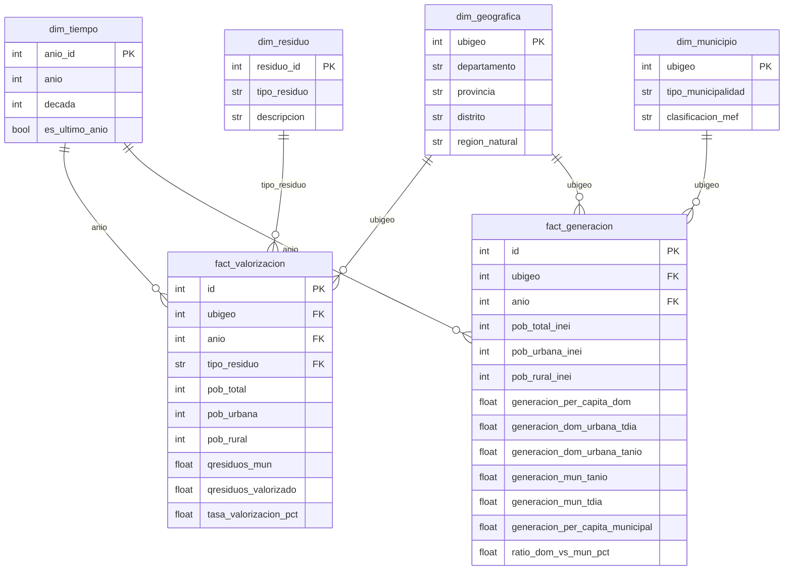

# Anális de Residuos Sólidos Perú 2019–2024 mediante técnicas de BI

---

## 1. Marco Teórico

### 1.1 Business Intelligence

El Business Intelligence (BI) comprende el conjunto de metodologías y tecnologías que permiten transformar datos en bruto en información significativa para la toma de decisiones estratégicas. A través del BI, las organizaciones pueden analizar el comportamiento histórico de sus procesos, identificar tendencias y anticipar escenarios futuros con base en evidencia. En el presente trabajo, el BI se aplica sobre los datos de SIGERSOL para dotar al MINAM de una herramienta analítica que facilite el monitoreo de la gestión de residuos sólidos a nivel nacional.

### 1.2 OLAP y Modelo Dimensional

OLAP (On-Line Analytical Processing) es una solución de BI que agiliza la consulta de grandes volúmenes de datos mediante estructuras multidimensionales, permitiendo analizar causas, encontrar patrones y obtener respuestas rápidas a preguntas complejas.

El modelo dimensional, propuesto por Ralph Kimball, es la base de diseño de estos sistemas. Organiza los datos en **tablas de hechos** — que contienen las métricas cuantitativas — y **tablas de dimensiones** — que proveen el contexto de análisis respondiendo las preguntas *¿quién?, ¿qué?, ¿cuándo?, ¿dónde?, ¿cómo?* La estructura recomendada es el **modelo en estrella**, donde la tabla de hechos se ubica al centro conectada a sus dimensiones, priorizando simplicidad y velocidad de consulta.

### 1.3 ETL y SQL

El proceso **ETL** (Extract, Transform, Load) permite construir el datamart extrayendo datos de las fuentes originales, transformándolos y limpiándolos según el modelo dimensional, y cargándolos en las tablas finales para su consulta. En nuestro proyecto, este proceso está implementado en los módulos `extract.py`, `transform.py` y `load.py`, ejecutándose de forma automatizada mediante un pipeline con CI/CD.

**SQL** (Structured Query Language) es el lenguaje utilizado para consultar el datamart, permitiendo calcular indicadores como tasas de valorización por departamento, evolución anual de generación de residuos o rankings de municipalidades por desempeño ambiental.

---

## 2. Descripción de la empresa

El **Ministerio del Ambiente (MINAM)** es el organismo rector de la política ambiental en el Perú, responsable de diseñar, establecer y supervisar la gestión sostenible de los recursos naturales a nivel nacional. En materia de residuos sólidos, el MINAM articula esfuerzos con gobiernos locales y regionales, y administra el **Sistema de Información para la Gestión de Residuos Sólidos (SIGERSOL)**, plataforma que centraliza el reporte anual de generación, valorización y disposición final de residuos a nivel distrital en todo el país.

En la actualidad, el MINAM ejecuta el programa **"Desarrollo de Sistemas de Gestión de Residuos Sólidos en Zonas Priorizadas"**, cofinanciado por el BID, cuyo objetivo es multiplicar el número de municipios ecoeficientes y garantizar el cumplimiento de las metas del Plan Nacional de Acción Ambiental. Si bien este programa alcanzó el 100% de sus metas comprometidas en su componente BID — recuperando 264 hectáreas degradadas y beneficiando a más de un millón de peruanos — la escala de intervención aún es insuficiente frente a la magnitud del problema ambiental nacional.

### 2.1 Problemática

Uno de los principales obstáculos que enfrenta el MINAM no es únicamente operativo, sino **de información y visibilidad**. Si bien SIGERSOL centraliza anualmente miles de registros distritales, esta información no se encuentra estructurada para el análisis, lo que genera una brecha entre los datos disponibles y la capacidad real de toma de decisiones, manifestada en:

- **Falta de visibilidad territorial:** No existe una vista consolidada que permita comparar el desempeño de distritos y regiones a lo largo del tiempo.
- **Dificultad para identificar brechas:** Sin un modelo analítico, es complejo detectar qué municipios tienen menor valorización, cuáles no reportan datos o dónde se concentran los mayores volúmenes de residuos sin tratamiento.
- **Decisiones poco basadas en evidencia:** La ausencia de indicadores consolidados limita la capacidad del MINAM para priorizar intervenciones y evaluar el impacto de sus programas a nivel nacional.

### 2.2 Nuestra propuesta

Frente a esta problemática, proponemos un **datamart analítico** construido sobre los datos de SIGERSOL (2019–2024), que estructure la información disponible en un modelo dimensional consultable, permitiendo al MINAM:

- Monitorear la evolución de la valorización y generación de residuos **a nivel distrital y regional**.
- Identificar **municipios críticos** con baja valorización o sin reporte de datos.
- Generar **indicadores comparables** entre períodos, regiones y tipos de municipalidad para apoyar la toma de decisiones estratégicas.

---

## 3. Modelamiento de Data Dimensional

### 3.1 Enfoque metodológico

El modelo dimensional fue construido siguiendo la metodología de Kimball, adoptando un esquema de **constelación de hechos** (*fact constellation* o *galaxy schema*), en el que dos tablas de hechos independientes comparten dimensiones comunes. Este enfoque es apropiado cuando se modelan múltiples procesos de negocio relacionados — en nuestro caso, la **valorización** y la **generación** de residuos sólidos — permitiendo analizarlos de forma independiente o cruzada.

### 3.2 Diagrama del modelo


### 3.3 Granularidad

| Tabla de hechos | Granularidad |
|---|---|
| `fact_valorizacion` | Un registro por distrito × año × tipo de residuo (orgánico / inorgánico) |
| `fact_generacion` | Un registro por distrito × año |

### 3.4 Dimensiones

#### `dim_tiempo`
Permite analizar la evolución temporal de los indicadores entre 2019 y 2024.

| Columna | Tipo | Descripción |
|---|---|---|
| `anio_id` | int | PK — identificador del año |
| `anio` | int | Año del período (2019–2024) |
| `decada` | int | Década correspondiente |
| `es_ultimo_anio` | bool | True si es el año más reciente del dataset |

#### `dim_geografica`
Provee el contexto territorial de cada registro, desde el nivel distrital hasta la región natural.

| Columna | Tipo | Descripción |
|---|---|---|
| `ubigeo` | int | PK — código de ubigeo INEI |
| `departamento` | str | Nombre del departamento |
| `provincia` | str | Nombre de la provincia |
| `distrito` | str | Nombre del distrito |
| `region_natural` | str | Costa / Sierra / Selva |

**Jerarquía:** `region_natural` → `departamento` → `provincia` → `distrito`

#### `dim_municipio`
Caracteriza cada municipio según su tipo y clasificación presupuestal, permitiendo comparar el desempeño entre distintas categorías de gobierno local.

| Columna | Tipo | Descripción |
|---|---|---|
| `ubigeo` | int | PK — código de ubigeo INEI |
| `tipo_municipalidad` | str | Provincial / Distrital |
| `clasificacion_mef` | str | Clasificación municipal MEF (A–G según capacidad fiscal) |

#### `dim_residuo`
Distingue el tipo de residuo analizado, permitiendo comparar la valorización orgánica e inorgánica bajo el mismo modelo.

| Columna | Tipo | Descripción |
|---|---|---|
| `residuo_id` | int | PK (1 = Orgánico, 2 = Inorgánico) |
| `tipo_residuo` | str | ORGANICO / INORGANICO |
| `descripcion` | str | Descripción del proceso de valorización asociado |

### 3.5 Tablas de hechos

#### `fact_valorizacion`
Registra la valorización de residuos orgánicos e inorgánicos a nivel distrital.

| Columna | Tipo | Descripción |
|---|---|---|
| `id` | int | PK surrogate |
| `ubigeo` | int | FK → dim_geografica |
| `anio` | int | FK → dim_tiempo |
| `tipo_residuo` | str | FK → dim_residuo |
| `pob_total` | int | Población total del distrito |
| `pob_urbana` | int | Población urbana |
| `pob_rural` | int | Población rural |
| `qresiduos_mun` | float | Residuos municipales generados (t/año) |
| `qresiduos_valorizado` | float | Residuos efectivamente valorizados (t/año) |
| `tasa_valorizacion_pct` | float | Porcentaje de valorización (`qresiduos_valorizado / qresiduos_mun × 100`) |

#### `fact_generacion`
Registra la generación de residuos domiciliarios y municipales a nivel distrital.

| Columna | Tipo | Descripción |
|---|---|---|
| `id` | int | PK surrogate |
| `ubigeo` | int | FK → dim_geografica |
| `anio` | int | FK → dim_tiempo |
| `pob_total_inei` | int | Población total (INEI) |
| `pob_urbana_inei` | int | Población urbana (INEI) |
| `pob_rural_inei` | int | Población rural (INEI) |
| `generacion_per_capita_dom` | float | Generación per cápita domiciliaria (kg/hab/día) |
| `generacion_dom_urbana_tdia` | float | Generación domiciliaria urbana (t/día) |
| `generacion_dom_urbana_tanio` | float | Generación domiciliaria urbana (t/año) |
| `generacion_mun_tanio` | float | Generación municipal total (t/año) |
| `generacion_mun_tdia` | float | Generación municipal total (t/día) |
| `generacion_per_capita_municipal` | float | Generación per cápita municipal (kg/hab/día) |
| `ratio_dom_vs_mun_pct` | float | Proporción de residuos domiciliarios sobre el total municipal (%) |

---

## 7. Estructura del repositorio

```
datamart-residuos/
├── data/
│   ├── raw/                   # Archivos originales (CSV / XLSX)
│   ├── processed/             # Datos limpios intermedios (generado por ETL)
│   └── marts/                 # Tablas finales (Parquet + DuckDB)
│       ├── dim_tiempo.parquet
│       ├── dim_geografica.parquet
│       ├── dim_municipio.parquet
│       ├── dim_residuo.parquet
│       ├── fact_valorizacion.parquet
│       ├── fact_generacion.parquet
│       └── datamart_residuos.duckdb
├── etl/
│   ├── extract.py             # Carga y normaliza archivos raw
│   ├── transform.py           # Construye dimensiones y tablas de hechos
│   └── load.py                # Carga a DuckDB y genera reporte de calidad
├── reportes/                       # Generado automáticamente al correr el pipeline
│   ├── 01_evolucion_nacional.png
│   ├── 01_evolucion_toneladas.png
│   ├── 02_top10_organico.png
│   ├── 02_top10_inorganico.png
│   ├── 03_region_natural.png
│   ├── 04_ranking_departamentos.png
│   ├── 05_mejora_organico.png
│   ├── 05_mejora_inorganico.png
│   ├── 06_per_capita.png
│   ├── 07_sin_valorizacion.png
│   ├── 08_tipo_municipalidad.png
│   └── *.txt                       # Versión en texto de cada reporte
├── tests/
│   └── test_marts.py          # Pruebas de integridad referencial y calidad
├── docs/
│   └── diccionario_datos.md   # Diccionario completo de columnas
├── .github/workflows/
│   └── etl.yml                # CI/CD — ejecuta pipeline en cada push
├── run_pipeline.py            # Punto de entrada único del pipeline
├── requirements.txt
└── .gitignore
```

## 8. Cómo usar

### 8.1 Instalar dependencias
```bash
pip install -r requirements.txt
```

### 8.2 Ejecutar el pipeline completo
```bash
python run_pipeline.py
```
Esto genera todos los archivos en `data/processed/` y `data/marts/`.

### 8.3 Correr los tests
```bash
pytest tests/ -v
```

### 8.4 Consultar el datamart con DuckDB
```python
import duckdb
con = duckdb.connect("data/marts/datamart_residuos.duckdb", read_only=True)

# Ejemplo: tasa de valorización orgánica por departamento en 2024
con.execute("""
    SELECT g.departamento,
           ROUND(AVG(v.tasa_valorizacion_pct), 2) AS tasa_promedio
    FROM fact_valorizacion v
    JOIN dim_geografica g USING (ubigeo)
    WHERE v.anio = 2024 AND v.tipo_residuo = 'ORGANICO'
    GROUP BY 1 ORDER BY 2 DESC
""").df()
```

También se puede leer directamente los Parquet con pandas:
```python
import pandas as pd
df = pd.read_parquet("data/marts/fact_valorizacion.parquet")
```

## Fuente de datos

- MINAM — Sistema de Información para la Gestión de Residuos Sólidos (SIGERSOL)
- Datos abiertos: [datosabiertos.gob.pe](https://www.datosabiertos.gob.pe)
